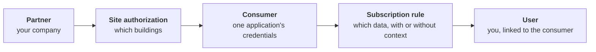

# Access Model and Permissions

From the welcome email to predictable data access, this guide explains why two valid credentials can return different results. Read this once before debugging empty payloads or missing context.

## Activate your account

Your welcome email contains an invitation link and the names of the objects created for you. Follow the link, set a password, and sign in to the sandbox portal:

<https://ecostruxure-building-platform-uat.se.app/>

UAT is where partner development happens. It carries representative data and the same API surface as production, so a client built against it needs a base URL change and nothing else when you move.

Follow [Setup Credentials](setup-credentials.md) to learn more about how to retrieve your credentials, save them securely, and validate them.

## The object model behind your access

Four objects decide what your token returns. You do not create them, Schneider Electric does, during onboarding, but every authenticated but empty result traces back to one of them, so it is worth knowing which.

What each object controls

| Object | Decides |
| --- | --- |
| **Partner** | Your company's record. Everything else hangs off it |
| **Site authorization** | Which buildings your company may see at all |
| **Consumer** | One application's identity and API types (Current Value, Historical, On Demand, Streaming) |
| **Subscription rule** | Which of the authorized data that consumer actually receives, and whether it carries context |
| **User** | Your personal login, linked to a consumer so you can retrieve its credentials |

**A consumer with no subscription rule authenticates perfectly and receives nothing.**
The rule is what selects your data, so until one exists there is nothing to return. This is the first thing to check when a call succeeds but comes back empty.

## With or without context

The subscription rule was created either **With Context** or **Without Context**. This is not an API setting, you cannot change it per request, and it applies identically to REST, GraphQL and streaming.

| | With context | Without context |
| --- | --- | --- |
| Each reading carries | Point name and unit, plus whichever of equipment, room, level, building and site the point is actually attached to | An identifier, a timestamp and a value |
| You must | Nothing, the message explains itself | Resolve every identifier against the API before you can label a reading |
| Suits | Dashboards, analytics, anything that labels or groups data | High-volume feeds into a system that already holds the model |

If your data arrives without names or locations and you expected them, that is a rule question for your Schneider Electric representative, not an API question.

## Portal rights and data rights are separate

Two different controls, and confusing them produces a request that cannot be answered as asked.

| Question | Controlled by | Values |
| --- | --- | --- |
| What can you change in the portal? | The permission group on your user | PartnerViewer, PartnerAdmin (partner side); SourceAdmin (data source side) |
| What can your application do to the data? | The authorization on the consumer's credentials | Read, Write, Create |

A **PartnerViewer** can hold credentials that write data back, the two are independent.
Conversely, some things need PartnerAdmin regardless of what your credentials allow:
changing the Event Hub telemetry payload is the one you are most likely to want.

| Task | Role |
| --- | --- |
| View consumers, retrieve API credentials | PartnerViewer or PartnerAdmin |
| Create consumers, subscription rules and users | PartnerAdmin |
| Change the Event Hub telemetry payload | PartnerAdmin |
| View or change Data Source connection secrets | SourceAdmin |
| Create a partner, authorize it for a site | Schneider Electric operations |

## What's Next

- [Set up and validate credentials for your flow](setup-credentials.md) |
- [Read or stream data from BDP](consuming-data.md) |
- [Send data into BDP](providing-data.md) |