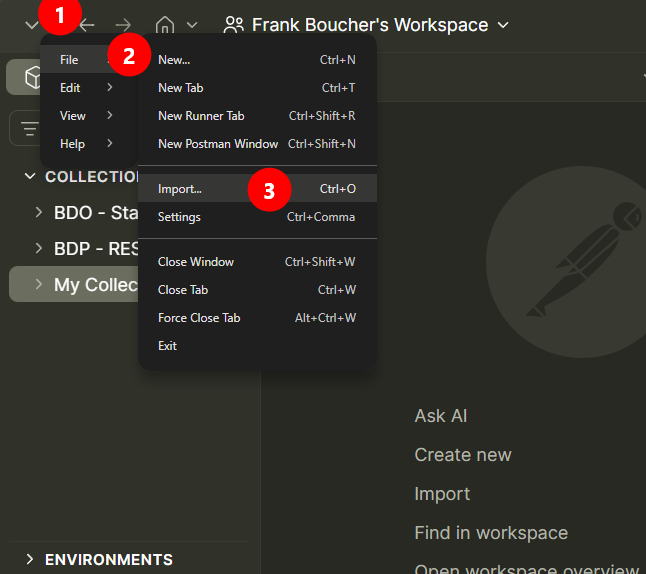
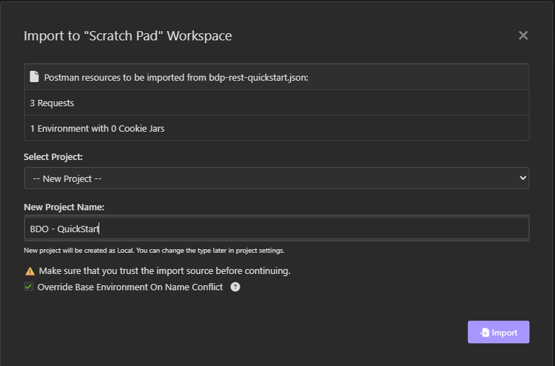

# Importing an API Collection File

## Goal

Import a BDP API collection file (Postman Collection Format v2.1) into a REST client
so you can send the requests without writing any code.

This page is generic on purpose. Every collection file in `examples/` uses the same
format and the same import flow, no matter which client you use, so this page is
referenced from each of those examples instead of repeating the steps.

## Prerequisites

- A REST client that supports the Postman Collection Format v2.1, for example
  Postman, Insomnia, Bruno, Thunder Client, or Hoppscotch.
- The collection file from the example folder, for example
  `examples/rest-quickstart-postman/bdp-rest-quickstart.json`.
- API token (See [Setup Credentials for API Clients](setup-credentials-api-clients.md))

## Steps

1. Open your client's import screen.

   The action is usually named **Import**. It is commonly available from a toolbar
   button, the File menu, or a workspace-level "+" menu.

   > Screenshot placeholder — client import screen
   > 

2. Select the collection file.

   Point the import dialog at the `.postman_collection.json` file from the example
   folder. Most clients detect the format automatically; you should not need to pick a
   format manually.

3. Confirm the import target.

   Some clients ask which workspace or folder to import into. Choose your personal
   workspace, not a shared/team one, so you do not accidentally share collection
   variables with teammates before you have set your own token.

   > Screenshot placeholder — import confirmation with workspace selector
   > 

4. Open the imported collection and locate its variables.

   Each example collection ships with variables for request parameters (for example
   `apiVersion`, paging values). The API host is a literal value inside each request's
   URL, not a variable. The bearer token is not a plain variable either: it is
   referenced from your client's vault, `{{vault:BDP_API_TOKEN}}`. Do not edit the
   committed file to add your token; instead follow
   [Setup Credentials for API Clients](setup-credentials-api-clients.md) to store it in
   your client's secret/vault storage.

5. Send a request.

   Open any request in the collection and send it. If the collection defines a
   collection-level auth (usually **Bearer Token**), every request inherits it
   automatically.

## Expected Outcome

- The collection appears in your client's sidebar with all its requests.
- Collection variables are visible and editable from the collection or environment
  settings.
- Sending a request without the vault secret set produces a `401` from the API, since
  the bearer token resolves to an empty or unresolved value.

## Notes

### Running the whole collection

Most clients include a way to run every request in a collection in sequence and see a
pass/fail summary (Postman calls this the **Runner**; other clients have equivalent
features).

### Keeping the file in the repository unchanged

Treat the imported collection as read-only reference material. If you need different
defaults (a different host, extra requests), fork it into your own workspace rather
than editing the checked-in file, so the example stays a reliable starting point for
the next person.

## What's Next

- [Setup Credentials for API Clients](setup-credentials-api-clients.md)
- [Setup Credentials](setup-credentials.md)
- [REST Quickstart (Postman)](../examples/rest-quickstart-postman/README.md)
