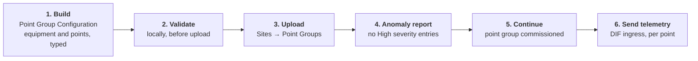

# Providing Data

For partners who send data *into* the platform, rather than only reading from it. Data
arrives over the **Data Integration Framework** (DIF), and nothing lands until the points
it refers to have been commissioned.

Specification:
[Ingress API (v1)](https://exchange.se.com/devportal/?api=bdp-ingress-api-spec-v1-bundle&id=894350)

## Before a single message can land

- [ ] A BDP account with **SourceAdmin** rights, this is what lets you view the Data
      Source connection secrets, and it is a different role from PartnerAdmin
- [ ] A **Site** (building, level, space) authorized for your **Data Source**
- [ ] A **Point Group** commissioned for that site, with at least one **Point**
- [ ] The Data Source **IoT Hub connection string**, from Data Sources → *your company* →
      *your source* → Connections → Primary Connection String

Providers collect credentials under **Data Sources**, not under a partner's Consumers or
Event Hubs. If you are also consuming data you will use both areas, and they are
configured independently.

Credential retrieval and secure handling are centralized in
[Setup Credentials](setup-credentials.md).

## Pre-flight validation checklist

Run this checklist before upload or telemetry send:

- [ ] `SourceId` and `LocatedInReferenceId` are from your own onboarding record
- [ ] Point group JSON is copied from the template and edited with your IDs
- [ ] Local validator returns no errors
- [ ] Data source connection string is set from Data Sources in the portal
- [ ] At least one point in `Timeseries[]` matches a commissioned `PointReferenceId`

Validation command path:

```bash
cd ../examples/point-group-config-python
python validate_config.py my_config.json
```

Expected result:

- Exit code `0` when there are no validation errors
- Human-readable findings list (or no findings)
- Use `--json` for machine-readable output in CI

## Two identifiers issued to you

Table – Identifiers issued per partner

| Value | What it is |
| --- | --- |
| `SourceId` | Your data source, issued with your ingress setup |
| `LocatedInReferenceId` | The site your data lands under |

Both appear in your welcome email. They are per-partner: never reuse another partner's.

## The flow



## 1–2. Build and validate the Point Group Configuration

The configuration declares your equipment and points, each typed against a controlled
vocabulary.

Its schema is documented in the [Ingress API (v1)
specification](https://exchange.se.com/devportal/?api=bdp-ingress-api-spec-v1-bundle&id=894350),
under **Point Group Configuration File**, with a field-by-field table for the point
group, for equipment and for points, and a worked example. That is the authoritative
source, the table below summarizes it, and the validator checks it.

Table – Accepted vocabularies

| Field | Accepted values |
| --- | --- |
| Equipment `ExactType` | Any [`brick:Equipment`](https://ontology.brickschema.org/brick/Equipment.html) class or a class derived from it, **or** a Schneider Electric Brick Extension class |
| Point `ExactType` | Any [`brick:Point`](https://ontology.brickschema.org/brick/Point.html) class or a class derived from it, **or** a Schneider Electric Brick Extension class |
| `UnitExactType` | Any [QUDT unit](https://www.qudt.org/doc/DOC_VOCAB-UNITS.html) class |

The Brick Extension namespace is `https://schneider-electric.com/schema/BrickExtension#`.
It covers equipment and points Brick does not model, access control and several
electrical measurements among them. It has no public ontology browser, the specification's
own supported-type list is where the classes are enumerated, so consult it before
concluding that no type fits.

Brick's top-level equipment categories are Camera, Electrical_Equipment, Elevator,
Fire_Safety_Equipment, Furniture, Gas_Distribution, HVAC_Equipment, ICT_Equipment,
Lighting_Equipment, Meter, Motor, PV_Panel, Relay, Safety_Equipment, Security_Equipment,
Shading_Equipment, Solar_Thermal_Collector, Steam_Distribution, Tank, Valve,
Water_Distribution, Water_Heater and Weather_Station, each with further subclasses. Use
the explorer links above to find the most specific class that fits. A too-general type is
accepted, but it loses exactly the semantics the platform exists to carry.

Template, field-by-field schema and a validator:
[point-group-config](../examples/point-group-config-python/).

**Validate before you upload.** Almost every anomaly report is caused by a mechanical
error, a missing field, a `DataType` outside the five allowed, an `ExactType` that is not
a URI, and each one costs a full round trip to discover remotely and a second to catch
locally.

## 3–5. Upload and commission

1. Sites → *your site* → **Point Groups**
2. Click **Update**, locate the configuration file, click **Update** again
3. Wait until the status reads **Check anomaly report**
4. Click the down-arrow icon to **Download Anomaly Report**
5. Confirm there are no **High** severity entries, other levels are informational
6. Click the **Continue** checkbox

A High severity entry means the configuration is rejected in part. Fix and re-upload
rather than continuing.

Once commissioned, the `PointGroupReferenceId` and each `PointReferenceId` become the
identifiers your telemetry is sent against.

## 6. Send telemetry

Messages are posted to `/devices/{deviceId}/messages/events` with
`api-version=2020-09-30`, authenticated by a SAS token generated from the Data Source
connection string.

Table – Message fields

| Field | Notes |
| --- | --- |
| `ProtocolVersion` | `"1.0"` |
| `SourceId` | UUID, must match the SourceId in your source details |
| `PointGroupReferenceId` | Must match the commissioned point group, unique within the data source |
| `NotificationType` | `"TimeSeries"`, the only value currently supported |
| `GeneratedAt` | ISO 8601 UTC with a `Z` suffix, when your connector built the message |
| `Timeseries[]` | `PointReferenceId`, `Timestamp`, `Value` |

Runnable example, with local validation before sending:
[dif-telemetry](../examples/dif-telemetry-python/).

## Limits

These are published in the Ingress API specification, and they shape a connector before
you write one: how many readings fit in a message, how fast you may send, and what comes
back when you exceed it.

Table – Published ingress limits

| Limit | Value | What happens at the boundary |
| --- | --- | --- |
| Message size | 4 KB per message | Chunk your readings, roughly 10 time-series points per message is the recommended shape |
| Message rate | 200 messages per second, per device | Messages queue and latency rises, sustained excess returns `429 ThrottlingException` |
| Connection rate | 360 new connections per second | Reuse connections rather than opening one per message |

Handle `429` with exponential backoff rather than an immediate retry, which only deepens
the queue.

## Ingestion semantics

Three rules decide what a connector can and cannot fix after the fact. They matter most
when you are planning an outage replay, a value correction, or a migration.

- **The first value received for a timestamp is the one that stands.** Historical data
  cannot be overwritten. Sending a corrected value for a timestamp already ingested has
  no effect, and the historical APIs continue to return the first value received.
- **The live value updates only for the same timestamp.** A value carrying a timestamp
  older than one already processed is ignored.
- **The framework is built for live ingestion.** Bulk historical upload is not supported
  through this path. If you need to load a large history, raise it with your Schneider
  Electric representative rather than pacing it through the ingress endpoint.

There is also no server-side schema validation, which is why the
[dif-telemetry](../examples/dif-telemetry-python/) example validates before sending and why your
connector should too.

## The one thing to understand before you build a connector

**A 2xx confirms delivery, not ingestion.** The response comes from Azure IoT Hub, which
acknowledges that it received the message. Ingestion happens downstream of that
acknowledgment.

If the `SourceId`, `PointGroupReferenceId` or `PointReferenceId` does not match a
commissioned point group authorized for the site, the message is discarded downstream and
the response is unchanged.

So confirm a new connector from the portal rather than from the response, and build that
check into your commissioning process. Once the identifiers are right, the same 2xx is a
reliable delivery signal.

## Client library

For production connectors, prefer the **Azure IoT SDK** over raw HTTPS. The
[dif-telemetry](../examples/dif-telemetry-python/) example uses HTTPS because it has no
dependencies and shows the protocol plainly, but the HTTPS abstractions carry significant
per-message overhead at telemetry volumes.

## Network requirements

Table – Outbound connections, UAT ingress

| Destination host | Port | Protocol |
| --- | --- | --- |
| `graph-bdpdif-uat.azure-devices.net` | 5671 | AMQP |
| `graph-bdpdif-uat.azure-devices.net` | 443 | HTTPS |
