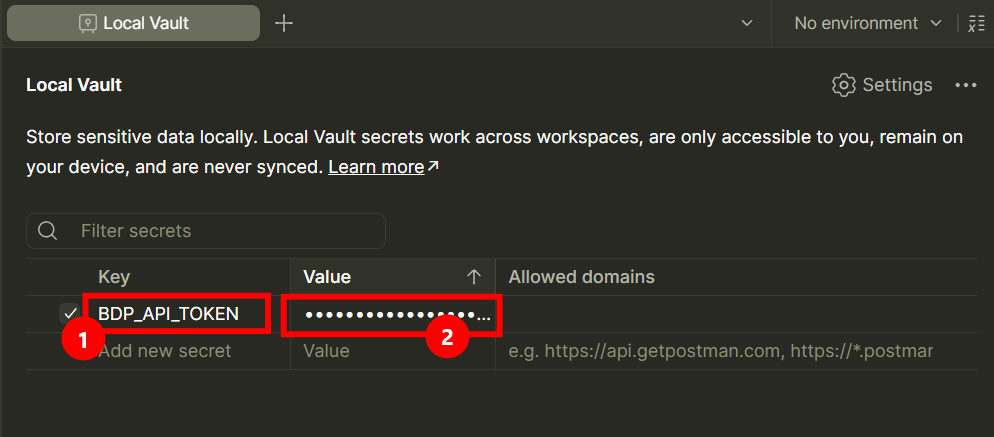
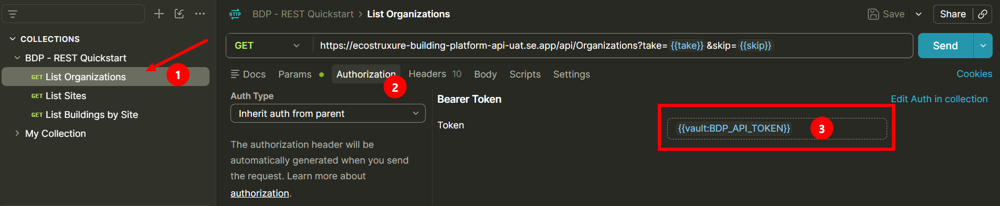

# Setup Credentials for API Clients

## Goal

Store your BDP API token in a GUI REST client (Postman, Insomnia, Bruno, or similar)
using its secret/vault storage, so the token never lands in an exported or committed
collection file.

This page complements [Setup Credentials](setup-credentials.md), which covers
environment variables and `.env` files for scripted examples. Use this page instead
when you are working from an API collection file, see
[Importing an API Collection File](importing-api-collections.md).

## Prerequisites

- A REST client with a secret-storage feature. Names differ by tool:
  - Postman: **Vault** (Settings -> Vault), or an environment variable marked secret
  - Insomnia: environment variables marked **Secret**, or a linked private environment
  - Bruno: collection **Secrets**, stored outside the synced `.bru` files
  - Other clients: check for a "secret", "private", or "vault" variable type
- API token (Portal -> Credentials -> System -> API Token). See
  [Setup Credentials](setup-credentials.md) for how to retrieve it.

## Steps

1. Open your client's secret storage.

   In Postman, open **Settings -> Vault** and enable it if this is the first time you
   are using it. Vault values stay on your machine only; they are never synced to your
   Postman account or included in exports.

2. Create a secret entry for your token.

   Add a new secret named `BDP_API_TOKEN` and paste the token value.

   > Screenshot placeholder — adding a BDP_API_TOKEN secret
   > 

3. Reference the secret directly from the collection, instead of typing the token
   value.

   - Postman Local Vault: reference the secret directly in any field (URL, header,
     Authorization value) using `{{vault:BDP_API_TOKEN}}`. No separate variable needed.
   - If your client does not support direct vault references, create a secret-typed
     environment or collection variable named `BDP_API_TOKEN`, set its value from the
     vault entry, and reference it as `{{BDP_API_TOKEN}}` instead.

   > Screenshot placeholder — collection variable referencing the secret
   > 

4. Verify nothing sensitive is included when you export.

   Export the collection (or environment) and open the exported file. Confirm
   `BDP_API_TOKEN` is empty or absent, never the real token value.

## Expected Outcome

- The token is stored in your client's local secret/vault storage, not in a collection
  or environment file.
- Exporting or sharing the collection does not leak the token.
- Requests that reference `{{vault:BDP_API_TOKEN}}` (or the equivalent secret-variable
  syntax for your client) succeed with a valid, current token.

## Notes

### Why not just use a normal variable?

A normal collection or environment variable's **initial value** is included when the
file is exported or synced to a team workspace. A token stored that way can leak the
moment the file is shared, even accidentally. Vault/secret storage keeps the value
local to your machine and out of every export.

### Rotating tokens

Tokens are short-lived by design. When requests start failing with `401`, copy a fresh
token from the portal and update the same secret entry, no collection changes needed.

See [Troubleshooting](troubleshooting.md) if a request fails after setting the token.

## What's Next

- [Importing an API Collection File](importing-api-collections.md)
- [Setup Credentials](setup-credentials.md)
- [Access Model and Permissions](access-model-and-permissions.md)
- [REST Quickstart (Postman)](../examples/rest-quickstart-postman/README.md)
