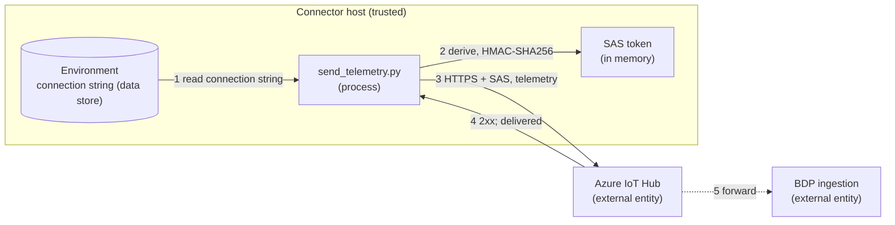

# Security: DIF Telemetry Ingress

The posture of this example. It is the only one that **writes** to the platform, so it has
the widest posture of the five.

## Credential Management

Table – Credentials

| Credential | Source | Grants | Notes |
| --- | --- | --- | --- |
| IoT Hub connection string | `BDP_DIF_CONNECTION_STRING` | Write access to ingest under that data source | Contains an embedded shared access key, treat it as a password |
| SAS token | Derived at runtime | One time-bounded session | Generated per run, never stored |

- No credential appears in the source, in `.env.template`, or in any default value.
- Not accepted as a command-line argument, because arguments land in shell history and in
  process listings.
- `.env` is excluded by the repository `.gitignore`.
- Viewing the connection string in the portal requires the **SourceAdmin** role. Holding
  PartnerAdmin is not sufficient, and that separation is deliberate: the credential can
  write into the platform's data.

### SAS tokens

The token is computed with HMAC-SHA256 over the resource URI and expiry, using the shared
access key decoded from the connection string. It is valid for `--expiry` seconds (default
3600), lives only in memory, and is regenerated on the next run.

In a long-running connector, refresh before expiry rather than lengthening the window, a
long-lived token is a long-lived liability, and expiry is the only revocation you control
from the client side.

## Network Security

Table – Connections

| Connection | Protocol | Port | Authentication |
| --- | --- | --- | --- |
| Azure IoT Hub | HTTPS | 443 | SAS token in the `Authorization` header |

- HTTPS with Python's default certificate validation. The example never disables it.
- The host comes from the connection string's `HostName`, not from user input.
- Production connectors should prefer the Azure IoT SDK, which additionally handles
  retry, backoff and token refresh, see the README.

## Input Validation

The message is validated **locally, before sending**, against what the protocol defines:
every required field is present and non-empty, `NotificationType` is one the protocol
allows, each reading carries `PointReferenceId`, `Timestamp` and `Value`, and each
`Value` is a boolean, number or string.

It does not check that `SourceId` is a well-formed UUID, that identifiers exist, or that
a value suits the point it names, the first is not enforced here, and the other two are
only knowable on the platform side.

That validation matters because the 2xx you get back confirms delivery to IoT Hub rather
than ingestion, so client-side checks are the earliest feedback available before the data
reaches the portal.

`--dry-run` prints the message without sending, so the shape can be reviewed before a
single byte leaves the machine.

## Logging Practices

No output path includes the connection string, the shared access key or the SAS token.

The success summary **does** print the `DeviceId`, `SourceId` and `PointGroupReferenceId`.
These are identifiers rather than secrets, but they identify your data source, do not
paste the output into a public issue.

## Threat Model

### Data Flow Diagram

### Trust Boundaries

- **Internet boundary**, flows 3 and 4. TLS, SAS token authentication.
- **Process boundary**, flow 1. Anything able to read the process environment can read
  the connection string.
- **Tenancy boundary**, flow 5. The platform binds the message to your data source and
  drops anything referring to identifiers you do not own.

### STRIDE Analysis

Table – STRIDE

| Category | Threat | Mitigation | Status |
| --- | --- | --- | --- |
| **Spoofing** | An attacker impersonates IoT Hub and harvests the SAS token | TLS with default certificate validation, the host comes from the connection string | Mitigated |
| **Spoofing** | A leaked key is used to inject false readings against your source | SAS expiry bounds the window, the platform binds ingestion to the data source. Report a leak so the key is rotated platform-side | Partially mitigated |
| **Tampering** | Telemetry is altered in transit | TLS integrity protection | Mitigated |
| **Repudiation** | Injected data cannot be distinguished from yours | IoT Hub records the device identity, the platform records the source | Mitigated (platform) |
| **Information Disclosure** | The connection string leaks via shell history, a process listing, a log or a commit | Environment variable only, never an argument, never printed, `.env` gitignored | Mitigated |
| **Denial of Service** | A runaway connector floods the endpoint | One request per invocation, readings batch into a single message. Rate-limit and back off in a long-running connector | Mitigated (operational) |
| **Elevation of Privilege** | The credential reaches another partner's data | The key is scoped to one device under one data source, unknown identifiers are dropped | Mitigated (platform) |
| **Data integrity** | A wrong `PointReferenceId` writes into another point's history | Local validation, plus the commissioning step that binds identifiers. Confirm values in the portal, a 2xx does not confirm ingestion | Partially mitigated |

## Delivery Is Not Ingestion

Because the 2xx confirms delivery to IoT Hub rather than ingestion, **absence of an error
is not by itself evidence of correctness**. Build a portal-side confirmation into your
commissioning process, and treat any change to identifiers as requiring re-verification.

## Compliance

See [SECURITY.md](../../SECURITY.md) at the repository root for vulnerability reporting
and the credential practices every example follows.
