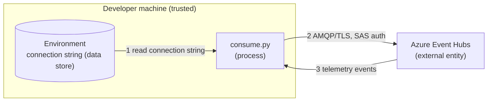

# Security: Event Hub Consumer

The posture of this example. It holds one connection string, opens one read-only stream,
and exits.

## Credential Management

Table – Credentials

| Credential | Source | Grants | Notes |
| --- | --- | --- | --- |
| Event Hub connection string | `BDP_EVENTHUB_CONNECTION_STRING` | Read access to that consumer's telemetry stream | Contains an embedded shared access key, treat it as a password |

That is the whole list. The example takes **one** credential, the one BDP issues, and it
reads no other environment variable, so there is no second secret to place, rotate or
leak.

- No credential appears in the source, in `.env.template`, or in any default value.
- It is not accepted as a command-line argument, because arguments land in shell history
  and in process listings.
- `.env` is excluded by the repository `.gitignore`.
- The connection string grants **read** on the stream. It cannot write data, change the
  payload selection, or reach any other consumer's hub.
- **One consumer, one credential.** If you run two applications, use two consumers so one
  can be rotated without stopping the other.

## Network Security

Table – Connections

| Connection | Protocol | Port | Authentication |
| --- | --- | --- | --- |
| Azure Event Hubs | AMQP over TLS | 5671 | Shared access key from the connection string |
| Azure Event Hubs | AMQP over WebSockets (TLS) | 443 | Same |

- Both transports are encrypted. The WebSocket transport tunnels the same AMQP session
  over 443 for networks where 5671 is closed, it is not a downgrade in protection.
- The WebSocket transport requires `websocket-client`. Without it the Azure SDK swallows
  the `ImportError` and retries silently, an availability problem, not a security one, but
  it is indistinguishable from a firewall block, so this example checks for the package up
  front rather than inheriting the hang.
- Certificate validation is left at the SDK's default. Do not disable it to work around a
  proxy.

## Input Validation

Event bodies are treated as opaque text. The example prints a summary, or the raw body
with `--raw`, it never parses telemetry into a structure it then acts on, and it never
evaluates message content.

If you extend it, validate and bound every field before use, the payload's shape is
configured per consumer and can change without your client changing.

## Resource Management

The receive loop is bounded twice: by `--count` and by `--timeout` since the last event.
The client is closed on every exit path, including the timeout and keyboard interrupt, so
the process terminates rather than holding a partition lease.

Every run replays from the same starting position. That is correct for a check and wrong
for a service, see the README, and note that resuming requires an Azure storage account
of your own, with the credential handling that implies.

## Logging Practices

No output path includes the connection string or the shared access key. Errors report the
partition and the SDK's message.

## Threat Model

### Data Flow Diagram

### Trust Boundaries

- **Internet boundary**, flows 2 and 3. TLS throughout, shared access key
  authentication.
- **Process boundary**, flow 1. Anything able to read the process environment can read
  the connection string.
- **Tenancy boundary**, the hub is scoped to one consumer. The credential cannot reach
  another partner's or another consumer's stream.

### STRIDE Analysis

Table – STRIDE

| Category | Threat | Mitigation | Status |
| --- | --- | --- | --- |
| **Spoofing** | An attacker impersonates the hub and harvests the key | TLS with default certificate validation, the host comes from the connection string, not from user input | Mitigated |
| **Tampering** | Telemetry is altered in transit | TLS integrity protection | Mitigated |
| **Repudiation** | A read cannot be attributed | Azure-side diagnostic logging, the key identifies the consumer | Mitigated (platform) |
| **Information Disclosure** | The connection string leaks via shell history, a process listing, a log or a commit | Environment variable only, never an argument, never printed, `.env` gitignored | Mitigated |
| **Information Disclosure** | Telemetry printed to a shared terminal or CI log | Summary output by default, `--raw` is opt-in. Do not run `--raw` in CI with real site data | Mitigated (operational) |
| **Denial of Service** | The client holds a partition lease indefinitely | Bounded by `--count` and `--timeout`, the client is closed on every exit path | Mitigated |
| **Denial of Service** | Two clients contend for one consumer group | Documented, give each application its own group | Mitigated (operational) |
| **Elevation of Privilege** | The credential grants more than reading | The connection string is read-scoped to one hub, changing the payload requires PartnerAdmin in the portal | Mitigated (platform) |

## Dependencies

This is the only example with third-party dependencies. Monitor the Azure Event Hub SDK
and `websocket-client` for known CVEs, and pin versions in your own project rather than
tracking latest.

## Compliance

See [SECURITY.md](../../SECURITY.md) at the repository root for vulnerability reporting
and the credential practices every example follows.
