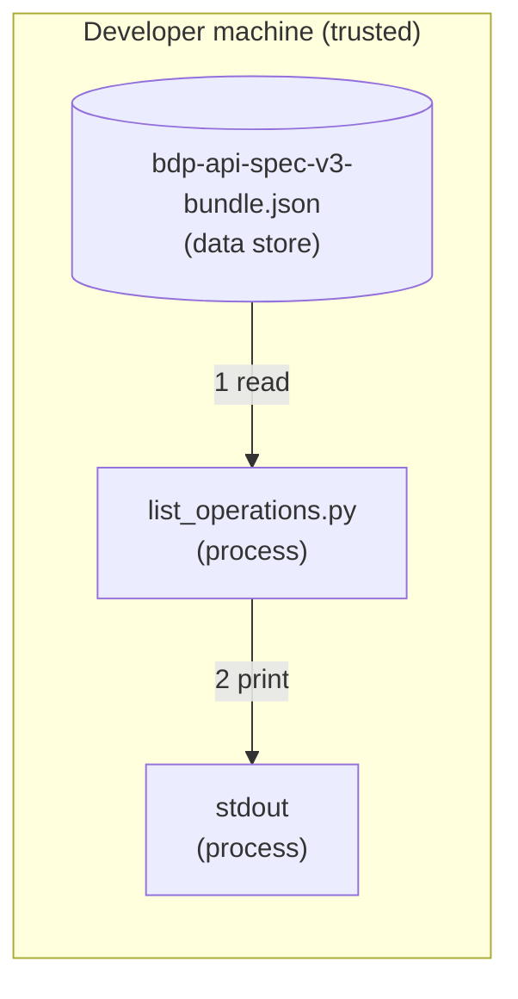

# Security: Explore REST Operations

The narrowest posture in this repository: `list_operations.py` reads a local OpenAPI
document and prints what it finds. It **makes no network call and handles no credential**.

## Credential Management

None. The example needs no token, accepts none, and reads no environment variable. That is
why there is no `.env.template` in this directory.

You will need a token to *call* the API, see
[Setup Credentials](../../docs/setup-credentials.md), but not to run this.

For how access configuration affects what valid credentials can see, read
[Access Model and Permissions](../../docs/access-model-and-permissions.md).

## Network Security

No outbound connection. The specification file is downloaded by you, from
[Exchange](https://exchange.se.com/devportal/?api=bdp-api-spec-v3-bundle&id=122362), over
your browser's HTTPS session.

## Input Validation

The specification is parsed as JSON. `$ref` pointers are resolved within the same document
only, the resolver does not follow external or remote references, so a specification
cannot cause the script to fetch anything.

Missing files and malformed JSON exit non-zero with a message naming the file, rather than
raising a traceback.

## Logging Practices

Output is the operation list. There is no credential to omit.

## Threat Model

### Data Flow Diagram

There is **no Internet boundary** and no trust boundary crossed at runtime: the script
reads a file you placed there and writes to your terminal.

### STRIDE Analysis

Table – STRIDE

| Category | Threat | Mitigation | Status |
| --- | --- | --- | --- |
| **Spoofing** | A substituted specification misleads client generation | Download the specification from Exchange over HTTPS and keep it under version control | Mitigated (process) |
| **Tampering** | The specification file is edited locally | Same, treat it as source, not as a cache | Mitigated (process) |
| **Repudiation** | Not applicable | No action is taken against any system | N/A |
| **Information Disclosure** | Not applicable | No credential is handled | N/A |
| **Denial of Service** | A very large or deeply nested specification exhausts memory | Single-pass parse of a document you supply, not exposed to untrusted input | Accepted |
| **Elevation of Privilege** | A malicious specification causes remote fetches | `$ref` resolution is document-local only | Mitigated |

## Generated Clients

The generators in the README produce code that *does* carry credentials. Everything in the
repository-root [SECURITY.md](../../SECURITY.md) applies to that code, in particular,
keep the token out of generated configuration files and out of logs.

## Compliance

See [SECURITY.md](../../SECURITY.md) at the repository root for vulnerability reporting.
