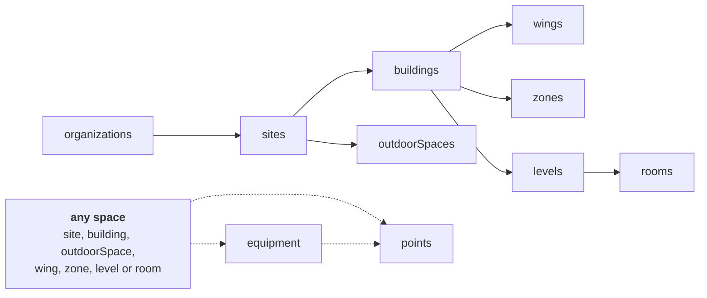

# GraphQL Quickstart (.NET projectless)


## Goal

Checks your API token, then shows what the API offers, by introspecting the live schema
rather than trusting a transcribed list.

This is the first thing to run after activating your account. No dependencies beyond
.NET SDK 10.0.100 and DotNetEnv for `.env` file support.

**The token check is a separate step, on purpose.** The GraphQL schema is public:
introspection succeeds whether or not your token is valid, so it tells you what the API
offers but nothing about your credentials. The script therefore checks the token with a
REST call to `/api/Sites` on the same host, which answers 401 when a token is expired or
malformed. Pass `--skip-token-check` to skip it.

## Prerequisites

- .NET SDK 10.0.100 or later (uses file-based apps)
- API token (See [Setup Credentials](../../docs/setup-credentials.md))
- Network access, Outbound HTTPS (443) to `ecostruxure-building-platform-api-uat.se.app`

## Steps

### 1. Go to the folder

```bash
cd examples/graphql-quickstart-dotnet
```

### 2. Set token

Choose one method.

#### Option A: `.env` file

1. Copy `.env.template` to `.env`.
2. Set your token:

```dotenv
BDP_API_TOKEN=eyJ...
```

The script reads `.env` automatically when `BDP_API_TOKEN` is not already set in the
environment.

#### Option B: environment variable

```bash
export BDP_API_TOKEN="eyJ..."
```

```powershell
$env:BDP_API_TOKEN = "eyJ..."
```

If both are set, the environment variable wins. `.env` is excluded by `.gitignore`.

### 3. Make first call: `dotnet introspect.cs`

```bash
dotnet introspect.cs
```

#### Expected outcome:

```text
token accepted (REST /api/Sites answered 200)

endpoint: https://ecostruxure-building-platform-api-uat.se.app/graphql

10 root queries:
  organizations
  sites
  buildings
  equipment
  points
  wings
  zones
  outdoorSpaces
  levels
  rooms

10 object type(s) exposed. Inspect one with:
  dotnet introspect.cs --type Site
```

- Exit code `0` when token check and introspection succeed.
- `token accepted (REST /api/Sites answered 200)`.
- A printed list of root queries (for example: `organizations`, `sites`, `buildings`,
  `equipment`, `points`, and others).
- A list of object types available for inspection.
- A clear distinction between credentials errors and query/model errors.

### 4. Make second call: `dotnet introspect.cs --type Site`

```bash
dotnet introspect.cs --type Site
```

#### Expected outcome:

```text
token accepted (REST /api/Sites answered 200)

OBJECT Site
  - outdoorSpaces
  - buildings
  - levels
  - wings
  - rooms
  - zones
  - equipment
  - points
  - isPartOf
  - isMeteredBy
  - isLocationOf
  - hasPoint
  - hasPart
  - calendarEvents
  - address
  - city
  - state
  - country
  - postalCode
  - timezone
  - timeSeriesRetentionSpanDays
  - id
  - name
  - exactType
  - type
  - metadata
```

Explanation:

- `token accepted ... 200` confirms your token is valid.
- `OBJECT Site` confirms GraphQL found the `Site` type.
- The bullet list under it are the fields available on `Site` in this environment.

## Notes

### Endpoint and authentication

Table – GraphQL endpoint

| | |
| --- | --- |
| UAT endpoint | `https://ecostruxure-building-platform-api-uat.se.app/graphql` |
| Production endpoint | `https://ecostruxure-building-platform-api.se.app/graphql` |
| Header | `Authorization: ****** |
| Token | Portal → Credentials → System → API Token |

`X-Api-Version` is optional on GraphQL. If you send it, it must be `2.0` or `3.0`, `1.0`
is rejected with `Unsupported API Version was requested`.

### Root queries

Ten entry points, each with filtering and optional paging:

`organizations`, `sites`, `outdoorSpaces`, `buildings`, `wings`, `zones`, `levels`,
`rooms`, `equipment`, `points`

These mirror the spatial hierarchy, which is why a GraphQL client can walk from an
organization down to an individual point without the intermediate lookups the REST API
needs.



**Solid arrows are containment. Dotted arrows are attachment**, and the two behave
differently.

Containment is a tree: an organization holds sites, a site holds buildings and outdoor
spaces, a building holds wings, zones and levels, a level holds rooms.

Equipment and points are **not** pinned to the bottom of that tree:

- A **point** attaches to a piece of equipment, *or* directly to a space. Any space
  qualifies except the organization, a point can sit on a building or a level with no
  equipment and no room involved.
- **Equipment** sits in a space, and that space need not be a room. A building or a level
  is just as valid.
- A **contextless point sits at the site**. With no context there is nothing finer to
  place it against, so the site is where it lands.

All of these shapes occur, and a real model mixes them:

Table – Shapes a point can take

| Attached to | Level and room | Equipment |
| --- | --- | --- |
| A point on equipment in a room | both present | present |
| A point on equipment on a building | both absent | present |
| A point on a building directly | both absent | absent |
| A contextless point, at the site | both absent | absent |

The REST surface reflects the same thing: `MeasurementValues` are retrievable under
Buildings, Floors, Spaces, Devices, DeviceGroups and DataSets, and `Devices` under
Buildings, Floors and Spaces. Those routes exist because points and equipment genuinely
live at each of those levels.

Write your traversal to handle a point wherever it appears, rather than assuming a fixed
depth. In REST, the `context` field on a measurement tells you which level applies.

### GraphQL sees more of the model than REST

`wings`, `zones` and `outdoorSpaces` have no REST endpoint. If your model uses them,
GraphQL is the only API that will show them to you, and a REST point can report a context
of `Wing` that REST itself cannot then resolve.

The three APIs also name things by their own conventions: a GraphQL `points` is a
`MeasurementValue` in REST, and `equipment` is a `Device`. Full mapping:
[Consuming Data: one model, three vocabularies](../../docs/consuming-data.md#one-model-three-vocabularies).

### Two vocabularies

Sites, buildings and levels are typed against [REC](https://w3id.org/rec), rooms,
equipment and points against Brick. You will see both namespaces in an `ExactType` field,
so match on the full URI rather than assuming one prefix.

### Exploring interactively

The **Try it** button on
[Schneider Electric Exchange](https://exchange.se.com/devportal/?api=bdp-graphql-api-spec-v1&id=122362)
is the supported explorer and the quickest way in.

You can also point your own client at the endpoint. Some IDEs issue a very large
introspection query automatically on connect, and that request can be refused in front
of the API even though ordinary queries from the same token succeed.

### Reading the failures

Table – Responses and what they mean

| Response | Meaning |
| --- | --- |
| **401** | Token expired or malformed |
| **403** returning an HTML error page | Refused *in front of* the API. The request never arrived, and your token was never examined |
| **403** with a JSON body | The API answered, you are authenticated but not entitled to that data |
| **400** with a GraphQL `errors` array | The API answered, a real query error, and the message says what is wrong |
| **200** with an empty result | Your subscription rule is missing, or filters out everything |

If everything returns 403 with an HTML page, it is not your credentials. See
[Troubleshooting](../../docs/troubleshooting.md).

### Context

Whether a response carries Brick semantic and spatial context depends on the subscription
rule your consumer was given (**With Context** or **Without Context**), not on which API
you call, and not on anything you can set per request.

Values arriving without semantics is a rule question, not an API question.

### Project Structure

Here is what each file does. The example is self-contained, it does not import any other files.

| File | Responsibility |
| --- | --- |
| `introspect.cs` | The complete example, token check, introspection query, and type lookup |
| `.env.template` | Names the environment variables, copy to `.env` and fill in |
| `README.md` / `SECURITY.md` | Usage and security posture |

## What's Next

- [Access Model and Permissions](../../docs/access-model-and-permissions.md)
- [Consuming Data](../../docs/consuming-data.md)
- [GraphQL API (v1) on Exchange](https://exchange.se.com/devportal/?api=bdp-graphql-api-spec-v1&id=122362)
