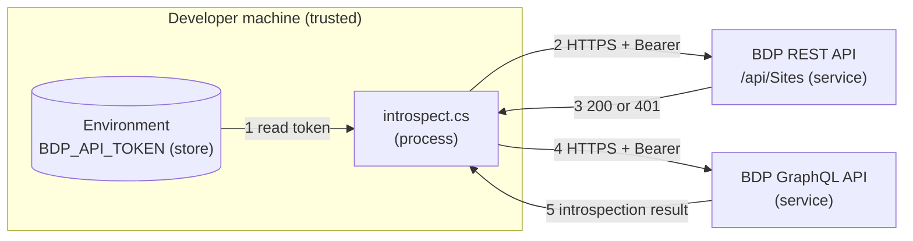

# Security: GraphQL Quickstart (.NET)

`introspect.cs` checks your API token, then introspects the GraphQL schema to show
what the API offers. It makes one REST call to verify the token, then up to two GraphQL
calls. All requests carry a bearer token, all to the same host, nothing is written to disk.

## Credential Management

Credential used:

- `BDP_API_TOKEN`

The script reads the token from the process environment first, then from a local
`.env` file when present. `.env` is excluded by `.gitignore`; keep it local.

The script does not accept credentials as command-line arguments, so tokens do not
land in shell history or process lists.

For how access configuration affects what valid credentials can see, read
[Access Model and Permissions](../../docs/access-model-and-permissions.md).

## Network Security

Outbound HTTPS only:

- UAT: `https://ecostruxure-building-platform-api-uat.se.app`
- Production: `https://ecostruxure-building-platform-api.se.app`

TLS certificate validation is left at the runtime default and is never disabled.

Three types of requests:

1. **Token check:** REST `GET /api/Sites` on the same host, to verify the token is
   accepted. This is separate because the GraphQL schema is public — a successful
   introspection proves nothing about token validity.
2. **Root queries:** GraphQL introspection of the root `__schema` and `queryType`.
3. **Type detail:** GraphQL lookup of a single type when `--type` is passed.

## Input Validation

The only user-supplied input that reaches the API is the type name on `--type`, and it
is rejected unless it matches the GraphQL name grammar (`[_A-Za-z][_0-9A-Za-z]*`).
This prevents injection into the query text.

HTTP failures are surfaced with status-specific messages. Where available, JSON error
bodies are parsed and reported.

## Logging Practices

The script prints request target, token check status, and response summary only.
It never prints the token value or any request headers.

## Threat Model

### Data Flow Diagram

### Trust Boundaries

- **Internet boundary**, between the script and the API (flows 2–5). TLS with a bearer
  token as the only authentication.
- **Process boundary**, between the environment and the script (flow 1). Anything able
  to read the process environment can read the token.

### STRIDE Analysis

Table – STRIDE

| Category | Threat | Mitigation | Status |
| --- | --- | --- | --- |
| **Spoofing** | An attacker impersonates the API and harvests the token | HTTPS with default certificate validation, the host is not user-supplied at runtime unless you pass `--endpoint` | Mitigated |
| **Tampering** | The introspection response is altered in transit | TLS integrity protection | Mitigated |
| **Repudiation** | A query cannot be traced back | Platform-side request logging, the token identifies the consumer | Mitigated (platform) |
| **Information Disclosure** | The token leaks through shell history, a process listing, a log or a commit | Environment variable only, never an argument, never printed, `.env` gitignored | Mitigated |
| **Denial of Service** | The script floods the API | Three requests per run, the process exits | Mitigated |
| **Elevation of Privilege** | The token grants more than intended | Scope is set platform-side by the consumer and its subscription rule, not by this client | Mitigated (platform) |

## Compliance

See [SECURITY.md](../../SECURITY.md) at the repository root for vulnerability reporting
and the credential practices every example follows.
