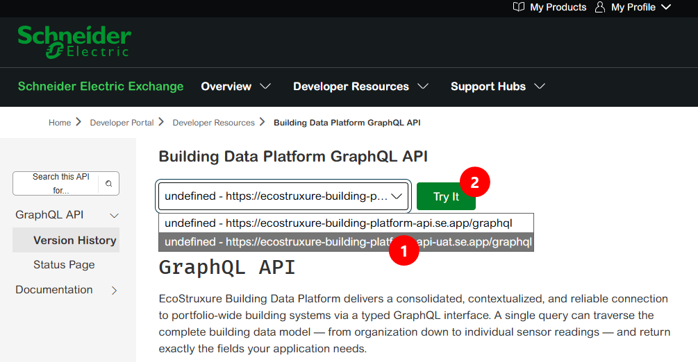
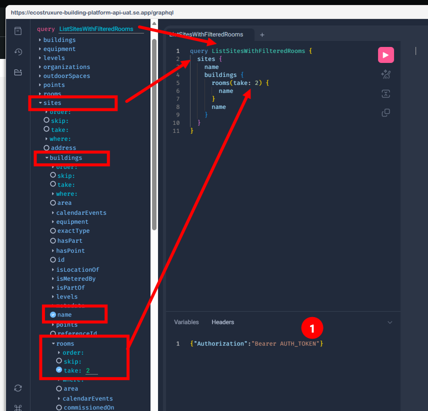

# GraphQL Quickstart (Postman)


> This example ships an API collection in the Postman Collection Format v2.1. That
> format is not Postman-exclusive: it also imports and runs in Insomnia, Bruno,
> Thunder Client, Hoppscotch, and headless.

## Goal

Checks that your token is accepted, then shows what the BDP GraphQL API offers by
introspecting the live schema. The collection keeps the token in your client's vault
and sends small queries rather than a large IDE-style introspection request.

The collection contains four requests:

- `Check Token` (REST `/api/Sites`)
- `List Root Queries` (GraphQL schema introspection)
- `Inspect Site Type` (GraphQL type introspection)
- `List Sites With Filtered Rooms` (a real GraphQL data query, not introspection)

The token check is separate on purpose. GraphQL schema introspection is public, so a
successful GraphQL response does not prove that the token is valid.

## Prerequisites

- A REST client that supports the Postman Collection Format v2.1 (desktop app or web)
- API token (See [Setup Credentials for API Clients](../../docs/setup-credentials-api-clients.md))
- Network: Outbound HTTPS (443) to `ecostruxure-building-platform-api-uat.se.app`

## Files

| File | Purpose |
| --- | --- |
| `bdp-graphql-quickstart.json` | The collection with the token check, two introspection requests, and one data query |

## Steps

### 1. Import the collection

Follow [Importing an API Collection File](../../docs/importing-api-collections.md) to
import `bdp-graphql-quickstart.json` into your client.

### 2. Set your token

Follow [Setup Credentials for API Clients](../../docs/setup-credentials-api-clients.md)
to store your token as a vault secret named `BDP_API_TOKEN`. The collection's
authorization already references it as `{{vault:BDP_API_TOKEN}}`, so no committed file
needs to contain a real token.

### 3. Send the requests

Run `Check Token` first. A `200` response confirms the token is accepted by the REST
API. Then run `List Root Queries` to see the live GraphQL entry points,
`Inspect Site Type` to see the fields currently exposed on `Site`, and
`List Sites With Filtered Rooms` to run an actual data query instead of introspection.

You can also run the whole collection with your client's runner (Postman calls this
the **Runner**).

## Expected Outcome

- `Check Token` returns HTTP `200` when the token is accepted.
- `List Root Queries` returns a JSON `data.__schema.queryType.fields` response.
- `Inspect Site Type` returns a JSON `data.__type` response for `Site`.
- `List Sites With Filtered Rooms` returns each site's `name`, each building's
  `name`, and the `name` of each room under those buildings. The query is kept
  intentionally simple to show nested selection and shaped responses without
  aggregation or counting.
- Each request's `status is 200` test passes in the test results panel.

Example root-query names include:

```text
organizations
sites
buildings
equipment
points
```

## Notes

### Building the `List Sites With Filtered Rooms` query

```graphql
query ListSitesWithFilteredRooms() {
  sites {
    name
    buildings {
      name
      rooms (take: 2) {
        name
      }
    }
  }
}
```

Reading it from the outside in:

- `sites` is a root query, one of the ten entry points listed by `List Root Queries`.
  With no arguments it returns every site your token is entitled to see.
- Each field you list under `sites` (`name`, `buildings`) is a selection: GraphQL
  returns exactly those fields and nothing else, which is the main reason to reach for
  it over REST when you want a shaped result in one round trip.
- `buildings` is a nested field on `Site`, so the response nests one level deeper: an
  array of buildings per site, each carrying only the fields you asked for (`name`).
- `rooms (take: 2)` is the same pattern one level further down: a nested collection on
  `Building`, but limited to the first two rooms in each building. `take` controls how
  many items are returned, while `name` still defines the only field included on each
  room.

The response should look like this, note the nested structure and the fact that only the requested fields are included at each level, and only a maximum of two rooms are returned per building.

```json
{
  "data": {
    "sites": [
      {
        "name": "BDP Demo Site",
        "buildings": [
          {
            "name": "Schneider Electric Boston",
            "rooms": [
              {
                "name": "Alpha"
              },
              {
                "name": "Beta"
              }
            ]
          },
          {
            "name": "Schneider Electric London",
            "rooms": [
              {
                "name": "Bathrooms"
              },
              {
                "name": "Bathrooms"
              }
            ]
          }
        ]
      }
    ]
  }
}
```

### Trying queries in an online editor

If you are new to GraphQL, an easy way to get started is with an online editor.
We included one in our documentation on [Schneider Electric Exchange](https://exchange.se.com/devportal/?api=bdp-graphql-api-spec-v1&id=122362), which is the supported interactive editor for the BDP GraphQL API.

- From the Exchange Portal, select `https://ecostruxure-building-platform-api-uat.se.app/graphql`, from the list of available endpoints, click the **Try it** button.

  

- This will open the interactive editor where you can paste and run GraphQL queries.
- Replace `AUTH_TOKEN`, at the bottom of the editor with your actual token.
- Execute the query **using** the play button at the top of the editor.

Compose simply by selecting the fields you want to include in your query using the GraphiQL Explorer.

- To rebuild the previous query, use the GraphiQL Explorer to select the `sites` field and its nested fields as needed.
- select the property `name`
- expand the nested fields as needed (e.g., `buildings` and `rooms`)
- For `room` select the property `name`, and `take:` to limit the number of rooms returned.

  

### Endpoints and variables

| Variable | Default | Meaning |
| --- | --- | --- |
| `apiVersion` | `3.0` | Value sent in the REST token check's `X-Api-Version` header |
| `typeName` | `Site` | GraphQL type inspected by `Inspect Site Type` |

The UAT endpoints are set directly in the requests:

- REST token check: `https://ecostruxure-building-platform-api-uat.se.app/api/Sites`
- GraphQL introspection: `https://ecostruxure-building-platform-api-uat.se.app/graphql`

To point the collection at production, edit the host in all four requests to
`ecostruxure-building-platform-api.se.app`.

The token is not a collection variable; it is referenced directly from your client's
vault as `{{vault:BDP_API_TOKEN}}`. See
[Setup Credentials for API Clients](../../docs/setup-credentials-api-clients.md).

### Authentication

Auth is defined once at collection level and inherited by every request. Tokens are
short-lived by design; re-copy a fresh token when requests start failing with `401`.

### GraphQL introspection

The collection uses small, focused introspection queries. A large introspection query,
such as the one some GraphQL IDEs issue automatically, can be refused by the gateway
even when ordinary queries succeed.


### Common failures

| Response | Meaning |
| --- | --- |
| **401** | Token expired or malformed |
| **403** with a JSON body | Token valid, but your consumer is not authorized for that data |
| **403** returning an HTML error page | Refused in front of the API; the request did not reach the API |
| **400** with a GraphQL `errors` array | The API answered with a query or model error |
| **200** with an empty result | Subscription rule is missing, or filters out everything |

See [Troubleshooting](../../docs/troubleshooting.md) for the 403 distinction.

## What's Next

- [Importing an API Collection File](../../docs/importing-api-collections.md)
- [Setup Credentials for API Clients](../../docs/setup-credentials-api-clients.md)
- [Access Model and Permissions](../../docs/access-model-and-permissions.md)
- [Consuming Data](../../docs/consuming-data.md)
- [GraphQL Quickstart (Python)](../graphql-quickstart-python/README.md)
- [GraphQL API (v1) on Exchange](https://exchange.se.com/devportal/?api=bdp-graphql-api-spec-v1&id=122362) — includes the **Try it** online editor
