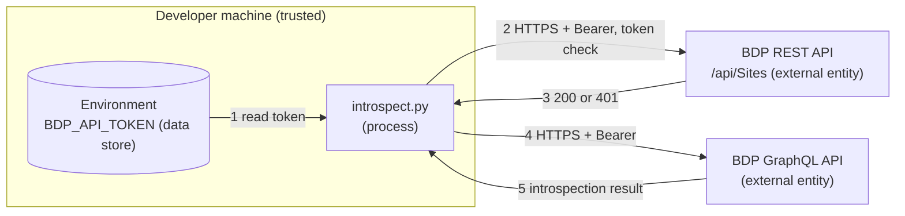

# Security: GraphQL Quickstart

The posture of this example. It is deliberately narrow: one REST token check plus up to
two GraphQL requests per run, all to the same host, all carrying the same bearer token,
and nothing is written to disk.

## Credential Management

Table – Credentials

| Credential | Source | Grants | Notes |
| --- | --- | --- | --- |
| API token | `BDP_API_TOKEN` environment variable | REST and GraphQL, as the consumer it belongs to | Never accepted as a command-line argument, never written to disk |

- No credential appears in the source, in `.env.template`, or in any default value.
- The token is not accepted as an argument, because arguments land in shell history and in
  process listings.
- `.env` is excluded by the repository `.gitignore`.

## Network Security

Table – Connections

| Connection | Protocol | Port | Authentication |
| --- | --- | --- | --- |
| REST `/api/Sites` — token check | HTTPS | 443 | `Authorization: Bearer <token>`, `X-Api-Version: 3.0` |
| GraphQL endpoint | HTTPS | 443 | `Authorization: Bearer <token>` |

- Both are HTTPS and certificate validation is left at Python's default. The example never
  disables it, and you should not disable it to work around a proxy.
- The token check goes to the same host as the GraphQL endpoint, derived from it, so
  `--endpoint` moves both. `--skip-token-check` removes the first call entirely.
- No other outbound call is made.

## Input Validation

The example sends fixed introspection queries, plus one type lookup whose name is
interpolated into the query text. That name comes from your own command line rather than
from anywhere untrusted, and it is rejected unless it matches the GraphQL name grammar
(`[_A-Za-z][_0-9A-Za-z]*`), so it cannot extend the query.

Responses are read as JSON and only field names are printed. Nothing received is
evaluated or executed.

## Logging Practices

No output path includes the token. Errors report the HTTP status and the response body,
never the request headers, an error message that echoes a header defeats every other
control here.

## Threat Model

STRIDE, following the same methodology as the other examples in this repository.

### Data Flow Diagram

### Trust Boundaries

- **Internet boundary**, between the script and the API (flows 2 and 3). TLS, with a
  bearer token as the only authentication.
- **Process boundary**, between the environment and the script (flow 1). Anything able to
  read the process environment can read the token.

### STRIDE Analysis

Table – STRIDE

| Category | Threat | Mitigation | Status |
| --- | --- | --- | --- |
| **Spoofing** | An attacker impersonates the API and harvests the token | HTTPS with default certificate validation, the host is not user-supplied at runtime unless you pass `--endpoint` | Mitigated |
| **Tampering** | The introspection response is altered in transit | TLS integrity protection | Mitigated |
| **Repudiation** | A query cannot be traced back | Platform-side request logging, the token identifies the consumer | Mitigated (platform) |
| **Information Disclosure** | The token leaks through shell history, a process listing, a log or a commit | Environment variable only, never an argument, never printed, `.env` gitignored | Mitigated |
| **Denial of Service** | The script floods the API | One introspection request per run, the process exits | Mitigated |
| **Elevation of Privilege** | The token grants more than intended | Scope is set platform-side by the consumer and its subscription rule, not by this client | Mitigated (platform) |

## Compliance

See [SECURITY.md](../../SECURITY.md) at the repository root for vulnerability reporting
and the credential practices every example follows.
