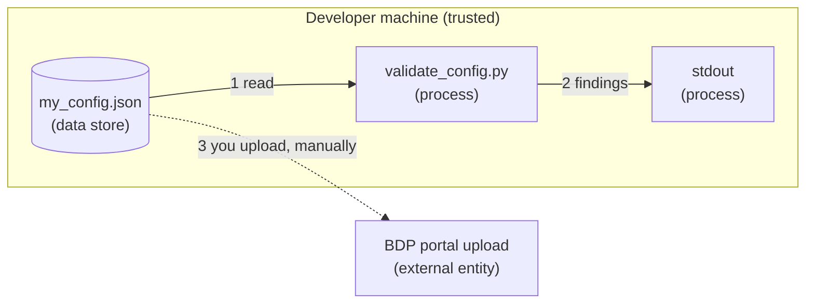

# Security: Point Group Configuration

The posture of this example. `validate_config.py` reads a local JSON file and prints
findings. It **makes no network call and handles no credential**.

## Credential Management

None. The validator needs no token and reads no environment variable.

The configuration file itself is not a credential, but it is **site-specific data**: it
names your equipment, your points and the identifiers the platform will bind telemetry to.
Treat it as you would a network diagram.

- `my_config.json` and `*.local.json` are excluded by the repository `.gitignore`.
- Do not paste a full configuration into a public issue or a chat. Quote the offending
  entry and its `DIF6xx` code instead.

## Network Security

No outbound connection. Validation is entirely local, which is the point: it is the step
that happens *before* anything leaves your machine.

## Input Validation

The configuration is parsed as JSON and checked structurally. Malformed JSON exits
non-zero naming the line and column, rather than raising a traceback.

The validator checks shape, required fields, the five allowed `DataType` values, URI
well-formedness and namespace for `ExactType` and `UnitExactType`, and uniqueness of
`ReferenceId` across the shared equipment-and-point namespace.

It does **not** resolve the Brick or QUDT vocabularies, and does not fetch them, no
network call is made to validate a type. A class that is well formed and in the right
namespace but does not exist will pass here and be reported by the platform's anomaly
report.

## Logging Practices

Output is the finding list, with severity, `DIF6xx` code and the JSON path of the offending
entry. Values are echoed only where the finding is about the value.

## Threat Model

### Data Flow Diagram

There is **no Internet boundary at runtime**. Flow 3 happens in your browser, after the
validator has run, and is not performed by this example.

### STRIDE Analysis

Table – STRIDE

| Category | Threat | Mitigation | Status |
| --- | --- | --- | --- |
| **Spoofing** | Not applicable | No authentication is performed | N/A |
| **Tampering** | A configuration is altered between validation and upload | Keep configurations under version control, the portal's anomaly report is the second check | Mitigated (process) |
| **Repudiation** | A commissioned point group cannot be traced to a change | Version-control the configuration, the platform records the upload | Mitigated (process) |
| **Information Disclosure** | A configuration exposing site layout is committed or pasted publicly | `.gitignore` excludes `my_config.json` and `*.local.json`, quote findings by code, not by file | Mitigated |
| **Denial of Service** | A very large configuration exhausts memory | Single-pass parse of a document you supply, not exposed to untrusted input | Accepted |
| **Elevation of Privilege** | A duplicate `ReferenceId` silently rebinds telemetry to another point | Reported as an **error**, not a warning, precisely because it is silent in production | Mitigated |

## Why the Duplicate Check Is an Error

Equipment and points share one `ReferenceId` namespace. A duplicate is accepted by shape
and rejected by nothing until telemetry starts landing against the wrong point, data
integrity damage that is hard to notice and harder to unwind. A rejected upload is
strictly better.

## Compliance

See [SECURITY.md](../../SECURITY.md) at the repository root for vulnerability reporting.
