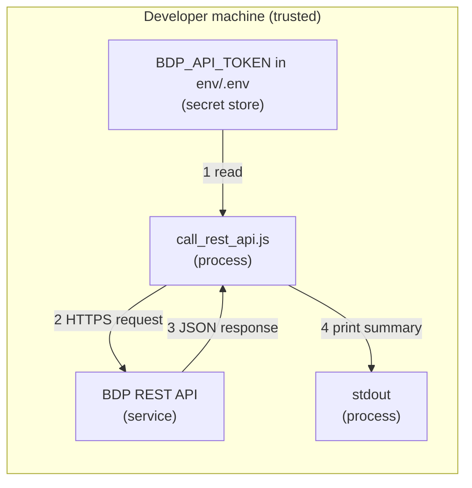

# Security: REST Quickstart (Node.js)

`call_rest_api.js` makes one authenticated HTTPS request to the REST API and prints a
small summary. It handles one bearer token from the environment.

## Credential Management

Credential used:

- `BDP_API_TOKEN`

The script reads the token from the process environment first, then from a local
`.env` file when present. `.env` is excluded by `.gitignore`; keep it local.

The script does not accept credentials as command-line arguments, so tokens do not
land in shell history or process lists.

For how access configuration affects what valid credentials can see, read
[Access Model and Permissions](../../docs/access-model-and-permissions.md).

## Network Security

Outbound HTTPS only:

- UAT: `https://ecostruxure-building-platform-api-uat.se.app`
- Production: `https://ecostruxure-building-platform-api.se.app`

TLS certificate validation is left at the standard library default and is never disabled.

## Input Validation

`--resource` is constrained to known values (`sites`, `organizations`, `buildings`) and
`buildings` requires `--site-id`. This prevents accidental calls to unintended paths.

HTTP failures are surfaced with status-specific messages. Where available, JSON error
bodies are summarized instead of dumped in full.

## Logging Practices

The script prints request target, status, and response summary only. It never prints
the token value.

## Threat Model

### Data Flow Diagram

Trust boundaries are crossed only once, at the HTTPS API call.

### STRIDE Analysis

Table - STRIDE

| Category | Threat | Mitigation | Status |
| --- | --- | --- | --- |
| **Spoofing** | Token stolen and reused | Keep token out of files/logs, rotate when exposed | Mitigated (process) |
| **Tampering** | Request changed in transit | HTTPS/TLS in standard library transport | Mitigated |
| **Repudiation** | Request source disputes | Platform-side logging and timestamped client logs | Accepted |
| **Information Disclosure** | Token printed accidentally | Script never echoes the token value | Mitigated |
| **Denial of Service** | Endpoint unavailable or slow | Explicit timeout and controlled failure path | Accepted |
| **Elevation of Privilege** | Calling unintended endpoints | Endpoint list constrained by `--resource` choices | Mitigated |

## Compliance

See [SECURITY.md](../../SECURITY.md) at the repository root for vulnerability reporting.
