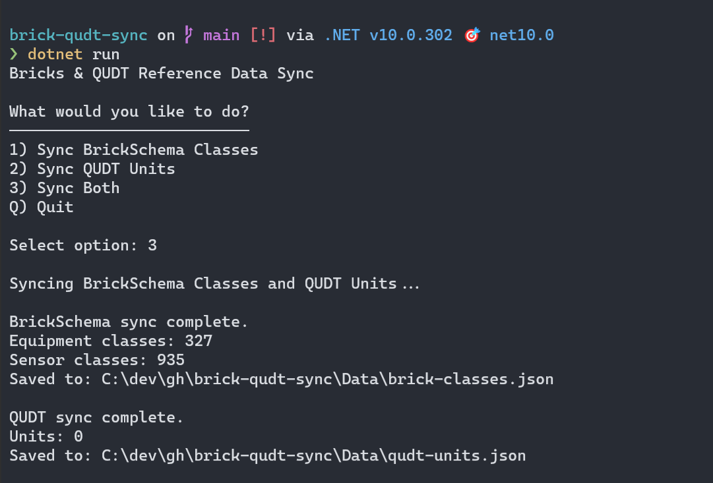

# Bricks & QUDT Reference Data Sync


A simple console application for downloading [BrickSchema](https://brickschema.org/) and [QUDT](https://github.com/qudt/qudt-public-repo) ontology reference data and saving it locally as JSON. Those file can then be use as local sources when describing physical, logical and virtual assets in buildings and measures.

## Quick Start

```bash
dotnet build 
dotnet run
```

## Usage

Download BrickSchema, QUDT Units, or both. When you are done grab your JSON file into the `/Data` folder.




## Output

- `Data/brick-classes.json` - BrickSchema equipment and sensor classes
- `Data/qudt-units.json` - QUDT unit definitions
